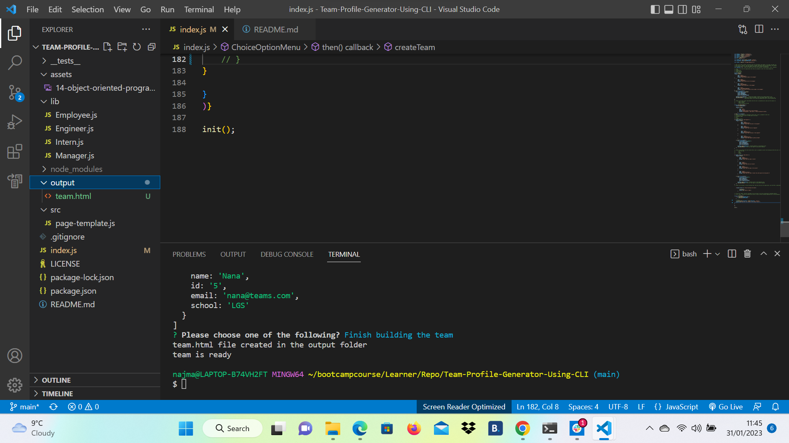

# Team-Profile-Generator-Using-CLI

This application is a command line application that takes user input based on questions provided and then generates an HTML webpage that displays the entire team. 

# Application Requirements

1. Installations of Node JS and its node modules
2. Terminal
3. VS code or any other source code editor

# Technologies Used

1. HTML
2. CSS
3. JavaScript
4. Nodejs
5. Inquirerjs
6. Jest

# Installation

1. Make a Repository on github and clone it to your machine using git clone command.
2. Push Starter code and make sure it contains json package. If json package is missing run npm init -y in terminal.
3. Check if all json dependencies are installed. This one requires inquirer and jest. If not installed , please install by running npm i inquirer@8 and npm i jest. We need the version 8 of the inquirer. More information on json dependency  inquirer can be found by clicking the [link](https://www.npmjs.com/package/inquirer) and json dependency jest can be found by clicking the [link](https://www.npmjs.com/package/jest)
4. After all deendencies install, run node index.js in terminal and first question should appear if everything is working okay or else error will pop up.
5. To check if jest test are working, type npm run test in terminal. Will let you know if any test has failed or passed.

# Illustration

Node js comand breaking up when choosing option finish building team

Output directory created with no team.html in it

Team.html created in output folder

Passing the test

Final product styling with style.css

# Conclusion

Working with node and in terminal is a new concept for me. Still getting use to it but overall it is challenging  and fun at the same time.

# References 
These are the references used to create the applicatcation.
1. Object Oriented JavaScript - [The Net Ninja](https://www.youtube.com/watch?v=4l3bTDlT6ZI&list=PL4cUxeGkcC9i5yvDkJgt60vNVWffpblB7&index=1). It is 11 part series.
2. Trilogy Education bootcamp class notes.
3. [W3 School](https://www.w3schools.com/js/js_object_constructors.asp)
